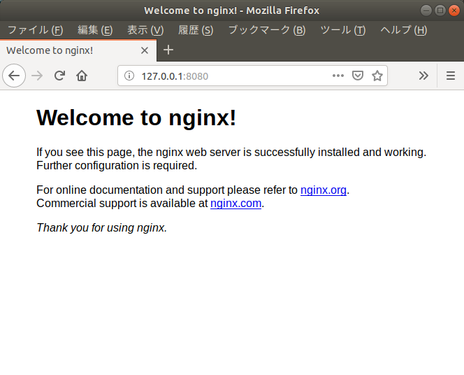
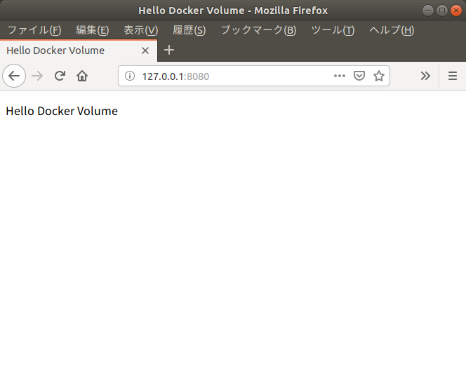

## 【基本課題】DockerコマンドでWelcome to nginxを表示させよう

### 条件

1. `docker`コマンドを用いて以下の画像のように、nginxのWelcome画面表示させよう。

1. nginxとはWebサーバーアプリケーションです。

1. nginxが問題なく動作しているとき、Webブラウザで80番ポートにアクセスするとWelcome画面が出力されます。

1. 下記画像では`http://127.0.0.1:8080`にアクセスして表示していますが、`IPアドレス`部分と`port番号`部分は好きな値でも問題はありません。

1. `nginx:1.15-alpine`イメージを使用してください。

上記の条件のとき、使用する`dockerコマンド`を解答としてください。



### Hint

#### nginxイメージについて

`nginx:1.15-alpine`Imageは`80`ポートが解放されています。

#### dockerコマンドのオプションもうまく使おう

下記コマンドでは要件は満たされないと思います。

どういったオプションコマンドが必要であるか調べたりしながら答えを見つけましょう。

オプションコマンドは複数適応させることも可能です。

```
docker run nginx:1.15-alpine
```

## 【応用課題】index.htmlを表示させましょう

## WindowsのDockerToolboxでは不可

### 条件

1. `docker`コマンドを使って`Hello Docker Volume`と表示するHTMLページを表示させましょう。

1. `volume`オプションを使ってこのディレクトリ内の`index.html`をコンテナに渡し、それを表示させてください。

1. 下記画像では`http://127.0.0.1:8080`にアクセスして表示していますが、`IPアドレス`部分または`port番号`部分は好きな値でも問題ありません。

1. `nginx:1.15-alpine`イメージを使用してください。

上記の条件のとき、使用する`dockerコマンド`を解答としてください。



### Hint

#### index.htmlについて

使用する`index.html`はこの`problem1`ディレクトリ内にあるものを使用してください。

#### volumeオプションについて

`docker`の`-v`オプションはホストPCのディレクトリとコンテナのディレクトリを共有できます。

```bash
-v ホストPCのマウント元の'絶対PATH':コンテナのマウント先の'絶対PATH'
```

#### nginxドキュメントルートについて

`nginx:1.15-alpine`イメージのデフォルトのドキュメントルートは下記のPATHです。

```
/usr/share/nginx/html
```

#### nginxを知ろう

何かがうまく行かないときは`docker`を疑う前に`ミドルウェア`を疑いましょう。

今回の`nginx`は、比較的、日本語でも調べれば色々出てきてくれます。

もう一つ、`nginx`と`nginxイメージ`は若干異なるということも覚えておきましょう。

そのため、調べ方としては`nginx docker`や`nginx image`など、`docker`と関連付けるような単語と併せるとよいでしょう。

## 【スペシャル課題】二つのNginxコンテナを起動させよう。

### 条件

1. Dockerでnginxコンテナを２つ起動させましょう。

1. いずれもアクセス可能な状況であることが達成条件です。

1. 例えば`http://127.0.0.1:8080`ではWelcome画面,`http://127.0.0.1:8888`ではHello Docker Volume画面など。

### Hint

#### ポート番号が重複しないようにしましょう。

使用するポート番号が重複してしまうと起動することができません。

例)
```bash
docker: Error response from daemon: driver failed programming 
external connectivity on endpoint dazzling_bhaskara (CONTAINER_ID): 
Bind for 0.0.0.0:8080 failed: port is already allocated.
```

## 【おかたづけ】Dockerコンテナをストップし、削除しましょう。

### 条件

1. 3つの課題で作成したコンテナについて、全て停止しましょう。

1. 3つの課題で作成したコンテナについて、全て削除しましょう。

### Hint

#### Dockerコンテナの停止方法とDockerコンテナの削除方法について

いろんな方法がありますが、消えていればなんでも良いです。

既に消しちゃってても問題ないです。ただのお片付けですから。
