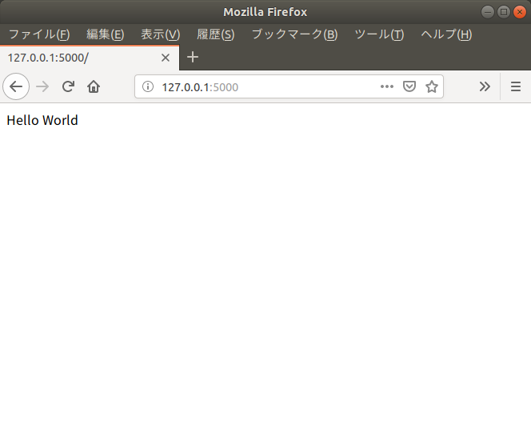
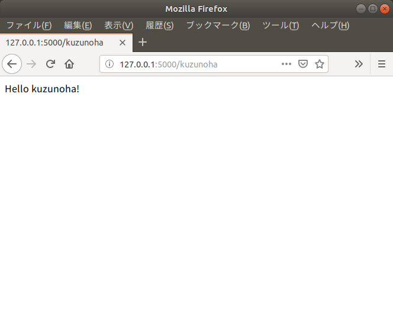

## 【基本課題】Dockerfileを完成させましょう

### 条件

1. `problem2-1`ディレクトリ内には`run.py`というWebアプリケーションを起動するプログラムがあります。このプログラムを実行するDockerfileを作成しましょう。

1. `run.py`はPythonで作成されています。また、`Flask`というWebフレームワークを使用しています。

1. `problem2-1`ディレクトリ内の`Dockerfile`はいくつか足りない記述があります。それを埋めるように書きましょう。

1. っていうか`自由`に書いてもらっても構いません。

1. ただし、コンテナ内の環境変数に次の値を入れる必要があります。

1. 環境変数「FLASK_ENV」に「development」という値を入れる。

1. 環境変数「FLASK_APP」に「run.py」という値を入れる。

1. 完成した`Dockerfile`を元にコンテナのポート番号`5000`をポートマッピングをして起動させましょう。

1. 以下のスクリーンショットのように表示していれば問題ありません。

1. また、http://IP_ADDRESS:PORT/kuzunohaとすれば`Hello kuzunoha`と表示されます。併せて確認しましょう。

上記の条件のとき

1. 使用する`Dockerfile`

1. その`Dockerfile`をbuildするコマンド

1. その`DockerImage`を元にコンテナを立ち上げるコマンド

それぞれを解答としてください。





### Hint

#### Dockerfile内のHint

`Dockerfile`内のコメントである`Hint`を元に書いてもらっても良いです。

## 【応用課題】DockerfileにARGSを持たせてフレキシブルなものにしよう

1. `problem2-2`ディレクトリ内には`run.py`というWebアプリケーションを起動するプログラムがあります。このプログラムを実行するDockerfileを作成しましょう。

1. 使用するベースイメージである`python`Imageのタグをフレキシブルに変更できるようにするため、`docker build`のオプションコマンド` --build-arg`を使って使用するタグを`3.6.8-alpine`か`3.7.3-alpine`変更できるようにします。

1. 例えば`docker build --build-arg ver=3.7.3 …`とすれば`python:3.7.3-alpine`をベースイメージにするようになる、など。

1. また`Flask`も環境変数「FLASK_ENV」に「development」か「production」を切り替えられるようにしましょう。

1. 例えば`docker build --build-arg env=production …`とすれば環境変数`FLASK_ENV`に`production`が代入されるなど。

1. 完成した`Dockerfile`を元にコンテナのポート番号`5000`をポートマッピングをして起動させましょう。

上記の条件のとき

1. 使用する`Dockerfile`

1. その`Dockerfile`をbuildするコマンド

1. その`DockerImage`を元にコンテナを立ち上げるコマンド

それぞれを解答としてください。

### Hint

#### ARGを使う

`ARG`とはDockerfile内で使える変数のようなものです。

`ARG hogehoge`で`hogehoge`という変数を宣言できます。

`RUN COMMAND ${hogehoge}`とすると変数を使用できます。

上記のような記載があるDockerfileについて

`docker build . --build-arg hogehoge=piyopiyo`とコマンドを打つと

`hogehoge`変数内に`piyopiyo`という値が代入されます。

その他については、調べて見ましょう。

#### デフォルト値も使ってみましょう。

オプションコマンド`--build-arg`について、このオプションを使用しない場合は、そのARGのデフォルトの値が使用されます。

`ARG hogehoge="piyopiyo"`とこのようにして使うことが出来ます。

## 【スペシャル課題】CharesetがUTF-8のMySQLイメージを作成しよう

#### 条件

1. MySQLのデフォルトのデータベースのcharsetは`latin1`というものを使用しています。

1. charsetを`utf8`に変更したmysqlイメージを作りましょう。

1. ベースイメージは`mysql:5.7.26`としてください。

1. mysql-cliで`show variables like '%char%';`と実行すると下記のようになっていれば、正解とします。

```
+--------------------------+----------------------------+
| Variable_name            | Value                      |
+--------------------------+----------------------------+
| character_set_client     | utf8                       |
| character_set_connection | utf8                       |
| character_set_database   | utf8   # ここがutf8        |
| character_set_filesystem | binary                     |
| character_set_results    | utf8                       |
| character_set_server     | utf8   # ここがutf8        | 
| character_set_system     | utf8                       |
| character_sets_dir       | /usr/share/mysql/charsets/ |
+--------------------------+----------------------------+
```

上記の条件のとき

1. 使用する`Dockerfile`

1. その`Dockerfile`をbuildするコマンド

1. その`DockerImage`を元にコンテナを立ち上げるコマンド

それぞれを解答としてください。

### Hint

#### ミドルウェアを理解するということ

発生する問題の大凡はミドルウェアのことをよく知らないから発生します。

そういった時に調べたり誰かに聞いたりするということをしましょう。

#### 沢山の解決方法

実はこれ、ググれば沢山の解決方法が出てきます。つまり、頻発する問題でもあるということです。

#### 自由に解決しましょう

実はDockerfileを作らなくても解決できます。解答はそれでも良しとします。

その場合は`dockerコマンド`を解答としてください。

## 【おかたづけ】作ったものは削除しましょう

### 条件

1. 3つの課題で作成したコンテナについて、全て停止しましょう。

1. 3つの課題で作成したコンテナについて、全て削除しましょう。

1. 3つの課題で作成したイメージについて、全て削除しましょう。

### Hint

#### Dockerイメージの削除方法について

いろんな方法がありますが、消えていればなんでも良いです。

既に消しちゃってても問題ないです。